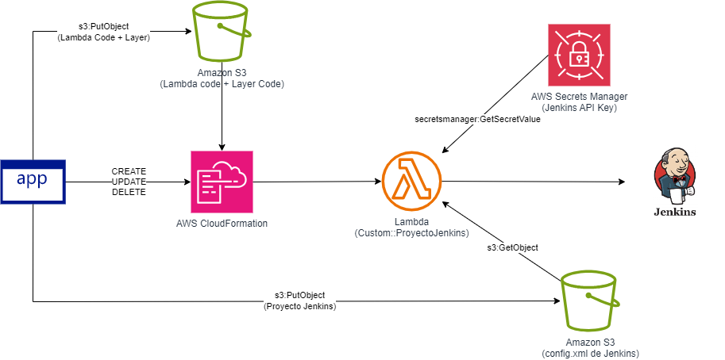

# Administración de Proyectos de Jenkins mediante AWS CloudFormation

<p align="center">
  
</p>

## Introducción

Este repositorio muestra cómo crear un proyecto de Jenkins automáticamente mediante recursos personalizados de AWS CloudFormation. Habilita las prácticas de Infraestructura como Código (IaC) permitiendo la creación, actualización, eliminación y configuración de proyectos administrada mediante plantillas de CloudFormation.

## Características

- Creación automatizada de proyectos Jenkins mediante AWS CloudFormation
- Despliegue de recursos personalizados basados en Lambda
- Soporte para ficheros de configuración XML de Jenkins
- Administración segura de claves API de Jenkins
- Integración con Amazon S3 para almacenamiento de artefactos

## Prerrequisitos

- Cuenta de AWS con permisos apropiados
- Servidor Jenkins con acceso administrativo (API Token)
- Python 3.x
- AWS CLI configurada con las credenciales apropiadas

## Arquitectura

La solución utiliza AWS Lambda para desplegar un recurso personalizado que se comunica con Jenkins mediante su API REST. Cuando la pila de AWS CloudFormation se crea o actualiza, la función Lambda crea o modifica el proyecto Jenkins apropiadamente.

## Instrucciones de configuración

1. **Crear un bucket de S3 para el código y dependencias de la función Lambda**
```bash
LAMBDA_BUCKET=<Lambda-Bucket>
aws s3 mb s3://$LAMBDA_BUCKET
mkdir -p layers/python
pip install -r requirements.txt -t layers/python/
```

2. **Instalar las dependencias de la función Lambda**
```bash
mkdir -p layers/python
pip install -r requirements.txt -t layers/python/
```

3. **Empaquetar y cargar la dependencia (layer) de la función Lambda**
```bash
LAYER_KEY=layer.zip
cd layers
zip -r $LAYER_KEY python
aws s3 cp $LAYER_KEY s3://$LAMBDA_BUCKET
```

4. **Empaquetar el código de la función Lambda**
```bash
LAMBDA_KEY=lambda.zip
cd ../proyecto-jenkins
zip $LAMBDA_KEY proyecto-jenkins.py
aws s3 cp $LAMBDA_KEY s3://$LAMBDA_BUCKET
```

5. **Crear un bucket de S3 para la configuración del proyecto Jenkins**
```bash
JENKINS_BUCKET=<jenkins-bucket>
JENKINS_KEY=<jenkins-config-key>
aws s3 mb s3://$JENKINS_BUCKET
aws s3 cp /path/to/jenkins-xml-config s3://$JENKINS_BUCKET/$JENKINS_KEY
```

6. **Desplegar la pila de AWS CloudFormation**
```bash
JENKINS_URL=<Jenkins-URL>
JENKINS_USERNAME=<Jenkins-Username>
JENKINS_API_TOKEN=<Jenkins-API-Token>
JENKINS_PROJECT=<Jenkins-Project-Name>

aws cloudformation deploy \
  --template-file template.yaml \
  --stack-name DemoJenkinsProjectStack \
  --capabilities CAPABILITY_IAM \
  --parameter-overrides \
    JenkinsUrl=$JENKINS_URL \
    JenkinsUsername=$JENKINS_USERNAME \
    JenkinsApiToken=$JENKINS_API_TOKEN \
    JenkinsProjectName=$JENKINS_PROJECT \
    LambdaS3Bucket=$LAMBDA_BUCKET \
    LambdaS3Key=$LAMBDA_KEY \
    LayerS3Key=$LAYER_KEY \
    JenkinsS3Bucket=$JENKINS_BUCKET \
    JenkinsS3Key=$JENKINS_KEY
```
## Estructura del proyecto

├── LICENSE
<br/>├── README.md
<br/>├── images/
<br/>│ └── jenkins-custom-resource.png
<br/>├── proyecto-jenkins/
<br/>│ └── proyecto-jenkins.py
<br/>├── requirements.txt
<br/>└── template.yaml


## Detalles de Implementación

### Función Lambda

La función Lambda actúa como un recurso personalizado que:
- Procesa eventos de CloudFormation (Create, Update, Delete)
- Se comunica con la API REST de Jenkins
- Gestiona la creación y configuración de proyectos
- Maneja respuestas y errores apropiadamente

### Plantilla CloudFormation

La plantilla `template.yaml` define:
- Función Lambda y su rol IAM asociado
- Layer de Lambda con dependencias
- Parámetros necesarios para la configuración
- Recurso personalizado que invoca la función Lambda

## Solución de Problemas

### Problemas Comunes

1. **Error de conexión con Jenkins**
   - Verificar la URL del servidor Jenkins
   - Comprobar la validez del token API
   - Confirmar la conectividad de red

2. **Fallos en la función Lambda**
   - Revisar los logs en CloudWatch
   - Verificar los permisos IAM
   - Comprobar el formato del archivo de configuración

3. **Errores de despliegue de CloudFormation**
   - Validar la sintaxis de la plantilla
   - Comprobar los valores de los parámetros
   - Revisar los permisos de S3

## Integración con AWS Service Catalog

### Beneficios de la Integración

Este proyecto puede fácilmente integrarse con AWS Service Catalog para ofrecer la administración de Proyectos Jenkin como Productos, lo que permite:
- Gestión centralizada de proyectos Jenkins como productos IT
- Aprovisionamiento self-service para equipos de desarrollo
- Control de acceso granular mediante portfolios
- Estandarización de configuraciones Jenkins
- Gobierno y cumplimiento normativo

### Pasos para la Integración

1. **Preparación del Portfolio**
   - Crear un portfolio en Service Catalog
   - Configurar los grupos de acceso
   - Establecer restricciones de lanzamiento
   - Definir roles IAM apropiados

2. **Creación del Producto**
   - Importar la plantilla CloudFormation como producto
   - Configurar versiones del producto
   - Establecer restricciones de despliegue
   - Definir parámetros permitidos

3. **Configuración de Gobierno**
   - Implementar políticas de etiquetado
   - Establecer controles presupuestarios
   - Definir restricciones por región
   - Configurar notificaciones

### Flujo de Trabajo del Usuario Final

1. **Acceso al Catálogo**
   - Navegar al Service Catalog
   - Seleccionar el portfolio apropiado
   - Elegir el producto de Jenkins

2. **Lanzamiento del Proyecto**
   - Completar los parámetros requeridos
   - Seleccionar opciones de configuración
   - Revisar y confirmar el lanzamiento
   - Monitorear el estado del despliegue

3. **Gestión del Ciclo de Vida**
   - Actualizar configuraciones
   - Gestionar versiones
   - Terminar recursos cuando sea necesario


## Referencias

- [Documentación de AWS CloudFormation](https://docs.aws.amazon.com/cloudformation/)
- [API de Jenkins](https://www.jenkins.io/doc/book/using/remote-access-api/)
- [AWS Lambda](https://docs.aws.amazon.com/lambda/)

## Contribuciones

Las contribuciones son bienvenidas. Por favor:

1. Haga fork del repositorio
2. Cree una rama para su característica
3. Realice sus cambios
4. Envíe un pull request

## Licencia

Este proyecto está licenciado bajo la Licencia MIT - ver el archivo LICENSE para más detalles.